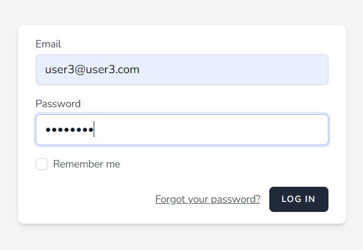
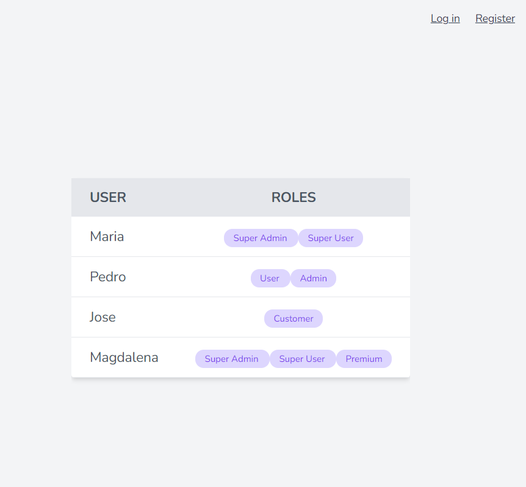
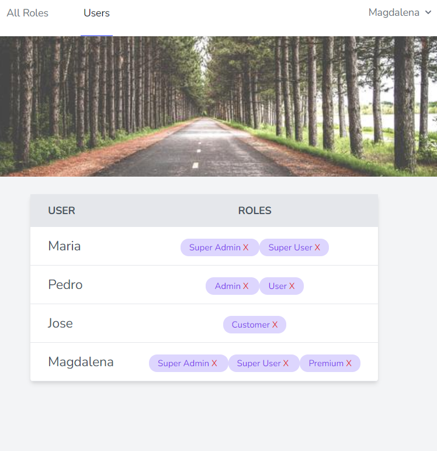
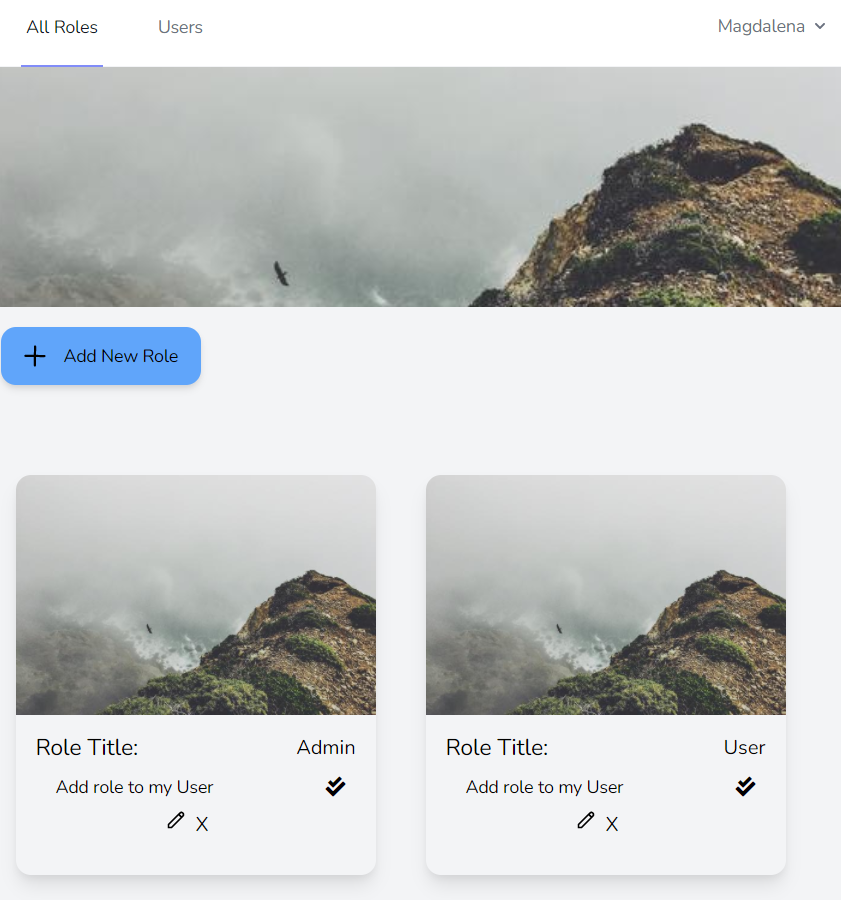
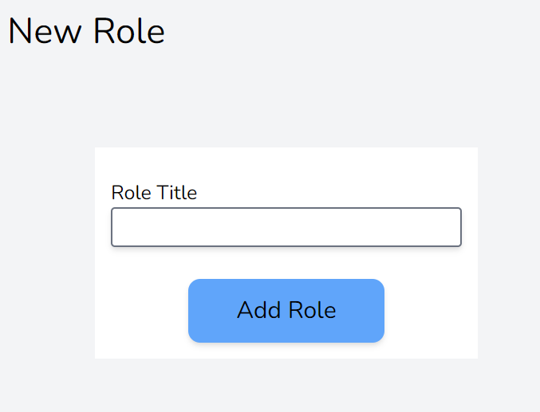
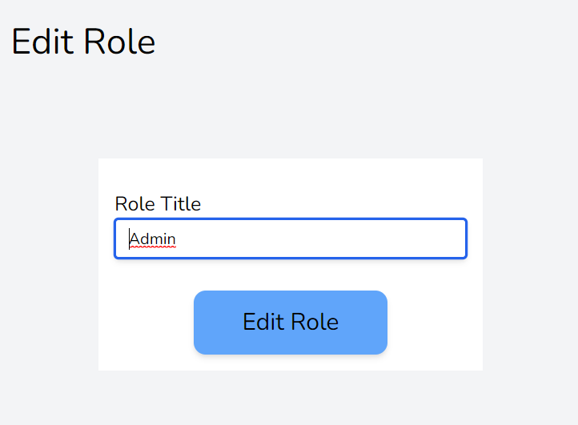

# ROLE APP

Una aplicación para crear, editar y eliminar Roles. Una vez te has logeado, empieza a crear roles que luego puedes asignarte a ti mismo. ¿Quieres ser Premium? en esta app lo puedes lograr!! 

# Autor ✒️

- Estefanie Garcia L

# Requisitos técnicos 🛠️

-   Laravel 8
-   PHP 7.4
-   composer 1.10.15
-   Docker

# Instalación 🚀

### Paso Uno: Clonar el repositorio 

`git clone https://github.com/estefanielunardi/appUserRoles.git` 

### Paso Dos: Running app (Docker)

`docker-compose up --build`

### Paso Tres: Seeder

`php artisan migrate:refresh --seed`

Con este comando se crean users y roles en la base de dato. Los usuarios pueden logearse en la app.

### Paso Cuatro: Running Tests

`php artisan test`

## Metodología de trabajo 💪

-   TDD
-   CI/CD

### Docker link 🌟

http://localhost/

## Login o Register con Laravel Breeze

-  Se implemento Laravel Breeze en la que ya vienen creadas plantillas de Blades para iniciar sesion y registrarse.

Route --> http://localhost/login

### Usuario NO Registrado

-  Estos usuarios llegan a una pagina inicial donde pueden ver una tabla con todos los usuarios y sus respectivos roles.

Route --> http://localhost/

-  No pueden crear, eliminar o asignar roles.

### Usuarios Registrados

-   En la aplicación los usuarios pueden ver tanto los roles que han creado ellos mismos como los roles que han creado otros usuarios.
-   Pueden acceder a una tabla donde observar todos los roles que tienen todos los usuarios del registrados en la app.

Route --> http://localhost/users

-   Pueden asignarse roles creados por ellos mismos.
-   Pueden asignarse roles creados por otros usuarios.

Route --> http://localhost/roles

-   Pueden crear, editar o eliminar roles creados por ellos mismos o por otro usuario.

Route --> http://localhost/role/create?

Route -->http://localhost/role/edit/1

-   Solo pueden eliminar roles asignados a si mismo como usuario.
-   No pueden añadir roles a otros usuarios.

## Aprendizajes

-   Crear Docker compose.
-   Trabajar con CI/CD.
-   Implementar GitHub Actions.

## Siguientes pasos 🖇️

- [ ] Incluir Mailtrap para enviar email a usuarios registrados.
- [ ] Incorporar feature donde los usuarios puedan asignar roles a otros usuarios.
- [ ] Añadir tabla de permisos para asignar acciones o autorizaciones que dependan de un rol especifico.
- [ ] Implementar componentes con React.
- [ ] Crear las vistas por componentes.
- [ ] Desacoplar backend y frontend en distintos servidores. 
- [ ] Aplicar una Api.
- [ ] Desarrollar mas el user flow por la aplicacion.
- [ ] Mejorar la experiencia UX/UI.
